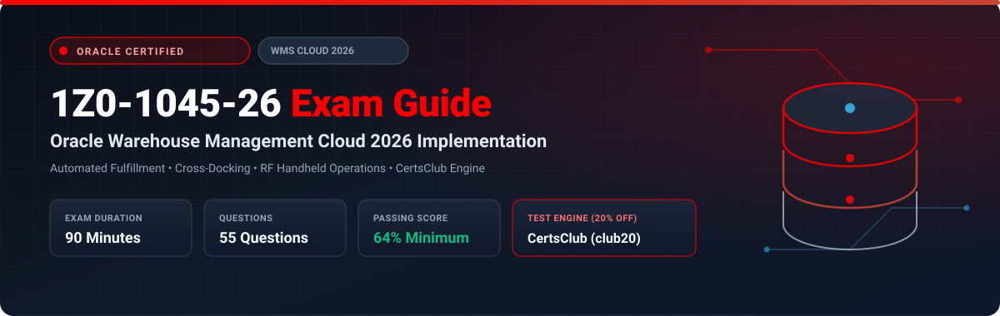

  

# Oracle Warehouse Management Cloud 2026 Implementation Professional (1Z0-1045-26) Exam Study Guide & Practice Test Resource Portal

[-f80000?style=for-the-badge&logo=oracle&logoColor=white)](https://education.oracle.com/)
[-f80000?style=for-the-badge&logo=oracle)](https://education.oracle.com/)

[-28a745?style=for-the-badge&logo=shield)](https://www.certsclub.com/oracle/)

---

## 1. Exam Overview & Candidate Profile

The **Oracle Warehouse Management Cloud 2026 Implementation Professional (1Z0-1045-26)** exam validates that an implementation consultant possesses the latest skills for rolling out, configuring, and optimizing Oracle WMS Cloud in automated fulfillment centers. Key areas tested include facility master setups, cross-docking rules, automated wave templates, dynamic picking, parcel carrier manifest integrations, and warehouse robotics interfaces.

Passing 1Z0-1045-26 awards the **Oracle Warehouse Management Cloud 2026 Certified Implementation Professional** credential.

### Target Candidate Profile & Career Roles
* **Lead WMS Functional Consultants**
* **Logistics & Automated Fulfillment Architects**
* **Supply Chain Technical Integration Specialists**

---

## 2. Key Exam Specifications

| Parameter | Official Specification |
| :--- | :--- |
| **Exam Code** | 1Z0-1045-26 |
| **Exam Title** | Oracle Warehouse Management Cloud 2026 Implementation Professional |
| **Associated Credential** | Oracle Warehouse Management Cloud 2026 Certified Implementation Professional |
| **Duration** | 90 Minutes |
| **Number of Questions** | 55 Questions |
| **Passing Score** | 64% |
| **Question Format** | Multiple Choice (Single and Multiple Select) |
| **Delivery Vendor** | Pearson VUE / Oracle University Online Remote Proctoring |
| **Recommended Practice Test Engine** | **[1Z0-1045-26 Practice Test - CertsClub](https://www.certsclub.com/oracle/)** (Coupon: `club20` for 20% off) |

---

## 3. Official Blueprint & Exam Domain Breakdown

| Domain Code | Domain Title | Weighting | Key Competencies Covered |
| :--- | :--- | :---: | :--- |
| **1.0** | **WMS Setup & Master Configuration** | **20%** | Facilities, locations, item classes, unit of measure conversions, carrier setups, barcode formats. |
| **2.0** | **Inbound Operations & Receiving Rules** | **25%** | ASN processing, Blind receiving, QA inspection rules, Cross-docking logic, Putaway strategies. |
| **3.0** | **Inventory Control & Replenishment** | **20%** | IBLPN status flows, Inventory adjustments, Cycle count rules, Demand-driven and top-off replenishment. |
| **4.0** | **Outbound Fulfillment & Waves** | **25%** | Wave allocation rules, Order grouping, Cluster and bulk picking, Shipping manifests. |
| **5.0** | **Automation, RF & Integrations** | **10%** | Modern mobile RF UI flows, Automated material handling system (MHE) integration, REST APIs. |

---

## 4. Scenario-Based Demo Question & Explanation

### Question 1: Cross-Docking Configuration
**Scenario:** A high-throughput distribution center wants to bypass putaway for rush inbound shipments when open backordered customer orders are waiting for the same item.

Which WMS feature accomplishes this direct routing?

A) Opportunistic Cross-Docking configured in Inbound Rules  
B) Blind Cycle Counting  
C) Top-off Replenishment  
D) Manual Relocation  

**Correct Answer:** **A**

**Detailed Explanation:**
* In Oracle WMS Cloud, **Opportunistic Cross-Docking** checks open outbound orders during the inbound receiving scan. If an active demand exists, the system automatically redirects the received LPN directly to an outbound staging or packing location, completely bypassing putaway to storage racks.

---

## 5. Recommended Preparation Strategy & Practice Testing Engine

1. **Configure Automated Waves:** Build multi-stage wave templates with automated picking allocation in an Oracle WMS Cloud sandbox.
2. **Practice with Full-Length Mock Exams:** Use **[CertsClub Oracle 1Z0-1045-26 Practice Tests](https://www.certsclub.com/oracle/)**.
   * Focuses on 2026 exam revisions, cross-docking rules, and parcel integration.
   * Enter discount coupon code **`club20`** at checkout on [CertsClub](https://www.certsclub.com/oracle/) for an immediate 20% discount.

---

## 6. Official Documentation & References

* [Oracle WMS Cloud Documentation 2026](https://docs.oracle.com/en/cloud/saas/supply-chain-management/wms/)
* [Oracle University 1Z0-1045-26 Exam Page](https://education.oracle.com/)
* [CertsClub 1Z0-1045-26 Practice Engine](https://www.certsclub.com/oracle/)
